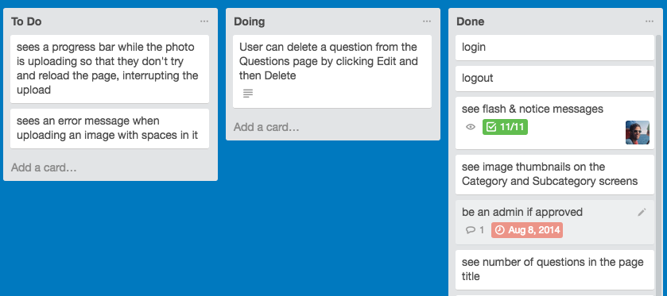

<!--
# ToDo

* Integrate parts of https://github.com/ga-wdi-lessons/agile
* Integrate Trello example
* Update formatting
* Integrate more interactive activities
* Discuss extreme programming
* expand TDD section
* Reorder sections/integrate challenges throughout
* me more specific about user stories challenge
* Discuss information chain: client -> user story -> test -> code 
* Agile is dead? (not an excuse to be unplanned) continuous integration is another movement inspired by agile.
* Discuss point system

-->

# Software Development Best Practices

### Why is this important?
<!-- framing the "why" in big-picture/real world examples -->
*This workshop is important because:*

Well-planned projects with flexible processes are more enjoyable to work on and turn out better. In the following workshop we will discuss how to plan appropriately and follow some best practices.

### What are the objectives?
<!-- specific/measurable goal for students to achieve -->
*After this workshop, developers will be able to:*

- Compare and contrast several development methodologies
- Define features as user stories
- Design mockups to inform the UI/UX

### Where should we be now?
<!-- call out the skills that are prerequisites -->
*Before this workshop, developers should already be able to:*

* Have projects in the planning phase

##Waterfall Methodology

Waterfall is a good example of a linear methodology in which the project's progress steady flows down from one team to another. It's "easy" manage due to the rigidity of the model.

###Consequences...

...

> What tends to happen to new projects in waterfall organizations?

## Agile Methodology

_Agile software development is a group of software development methods in which requirements and solutions evolve through collaboration between self-organizing, cross-functional teams. It promotes adaptive planning, evolutionary development, early delivery, continuous improvement, and encourages rapid and flexible response to change_- [Wikipedia](http://en.wikipedia.org/wiki/Agile_software_development)

The Agile Manifesto is a formal "proclamation" of key values for approaching software development put together in 2001. Let's discuss its core 12 principles:

* Our highest priority is to **satisfy the customer**
through early and **continuous delivery
of valuable software**.

* **Welcome changing requirements**, even late in 
development. Agile processes harness change for 
the customer's competitive advantage.

* **Deliver working software frequently**, from a 
couple of weeks to a couple of months, with a 
preference to the shorter timescale.

* Business people and developers must **work 
together** daily throughout the project.

* Build projects around **motivated individuals**. 
Give them the environment and support they need, 
and trust them to get the job done.

* The most efficient and effective method of 
conveying information to and within a development 
team is **face-to-face conversation**.

* **Working software** is the primary measure of progress.

* Agile processes promote **sustainable development**. 
The sponsors, developers, and users should be able 
to maintain a constant pace indefinitely.

* Continuous attention to technical excellence 
and **good design** enhances agility.

* **Simplicity**--the art of maximizing the amount 
of work not done--is essential.

* The best architectures, requirements, and designs 
emerge from **self-organizing teams**.

* At regular intervals, the team **reflects on how 
to become more effective**, then tunes and adjusts 
its behavior accordingly.

## Best practices

####Satisfy the Customer

* **User stories** define the features an application will provide in a simple and concise way.

* **Wireframes** define the user interface of the application.

####Deliver Working Software

* **Pair programming** is development technique in which two programmers work on a specific problem together.

* **Test-driven development** improves code design and quality.

###Work Together

* **Scrum meetings** are short meetings used to plan, review, and increase accountability and clarity across a team.

* **Retrospectives** a period for reflection at the end of each sprint.

## User Stories

###How do I know what the client wants?

When you meet with the client translate all the features that you discuss into **user stories** following the format:

**A user *(specified type optional)* can [GOAL], *so that [PURPOSE]***

For example:

- _A user can read reviews of a book (so that they are better informed when making a purchase)._
- _An admin can update the inventory of a book so that the buyers know what is available._

###How can I make an accurate time and budget quote on a project?

As a user story complexity increases linearly, its time to complete it will increase geometrically. As a result, when assigning weighing each user story's relative complexity assign it a fibonacci number that corresponds to the relative time it will require. This is called the **point system** and is a great way to budget time and money.

**[1, 2, 3, 5, 8, 13, 21]**

corresponds to:

**[easiest, easier, easy, moderate, hard, harder, hardest]**

*Note: If something is every bigger than 21 points, consider breaking it down into more user stories.*

Once all the user stories are assigned points, it is possible to start estimating how many points can be completed in a given period of time. A **sprint** is a period of predefined time, typically 1-2 weeks, during which teams aim to complete a set of user stories. The team initially estimates how many points is realistic to accomplish during the a sprint. Once the team completes a sprint, they can measure the rate of points completed in a given of time, or their **velocity**. Knowing the current and average velocities of the team, allows for more accurate projections into the future. 

A collection of user stories will contain an overall point score.

###What tools should I use to do this?

Head to [Trello](https://trello.com), make a new board, and create three lists: "To Do", "Doing", and "Done".

<figure>
  
   
  <figcaption>Kanban-style user stories</figcaption>
</figure>

For each user story it is possible to break it down into sub tasks.

<figure>
  
   
  <figcaption>A user story's tasks</figcaption>
</figure>

> Challenge: Write an example user story either for tick-tack-toe for an original game you are planning to build.

## Wireframes

Wireframes illustrate how the user **navigates** to and **interfaces** with **information** presented to them.

Having user stories will better inform wireframes, while having wireframes will help further refine the user stories. They are very complementary in this way.

Can the user intuitively **navigate** through the experience and **interface** with the **information** presented to them?

<figure>
  
   
  <figcaption>An example wireframe</figcaption>
</figure>

> Challenge: Wire frame the new page for [Tesla's Model 3](https://www.teslamotors.com/model3)

##Pair Programming

The practice of pair programming is cited to **improve code quality** through an increase in communication, **facilitate team cohesion** through collective code ownership, **improve long-term velocity** through a reduction in errors made, in addition to other benefits. 

One programmer, the driver, writes code while the other, the navigator, reviews each line of code as it is typed in. The two programmers switch roles frequently.

##TDD

Test driven development will improve the design and quality of the code written. It follows the cycle:

>Note: pair programming and TDD can work well together in a [ping pong pattern](http://c2.com/cgi/wiki?PairProgrammingPingPongPattern).

##Scrum

##Retrospective

##Closing Thoughts

- How do user stories help manage a client/boss?
- Name two process a team can adhere to in order to improve the quality of the code produced.
- Name one way a team can better self-organize and improve to become more effective.